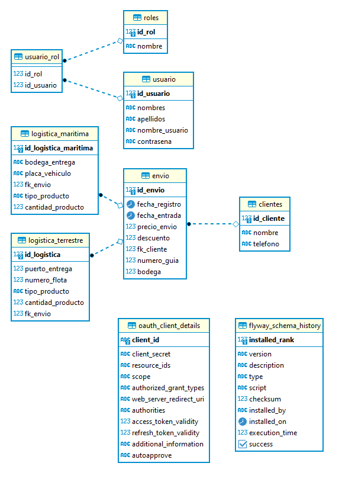
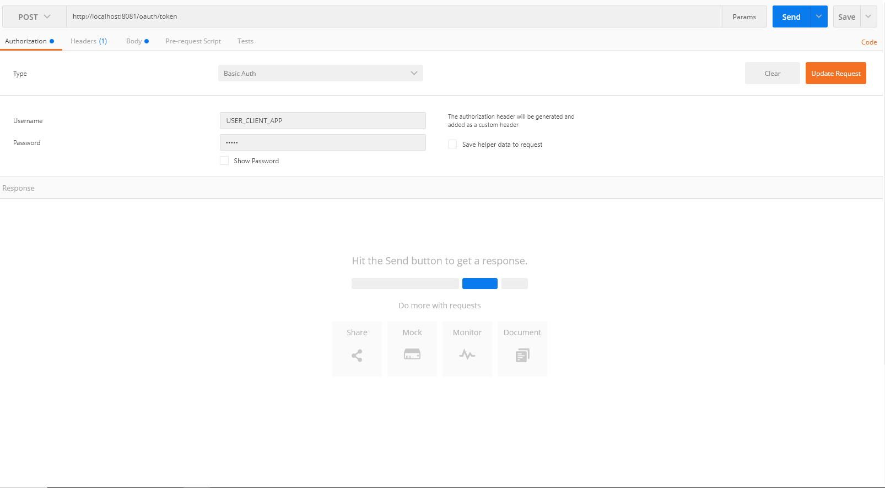
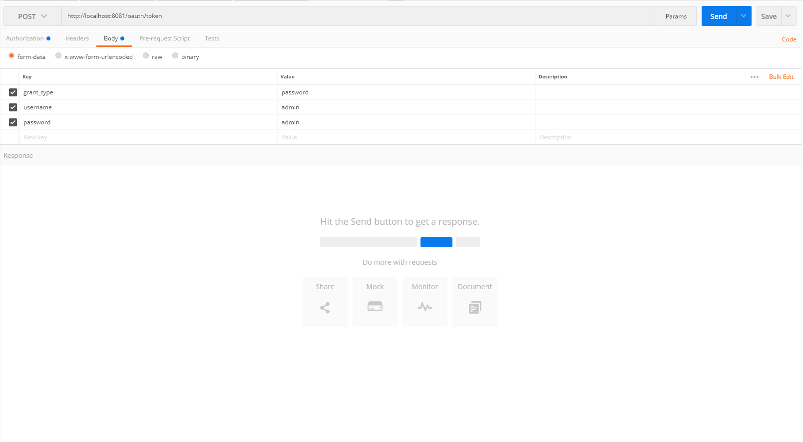
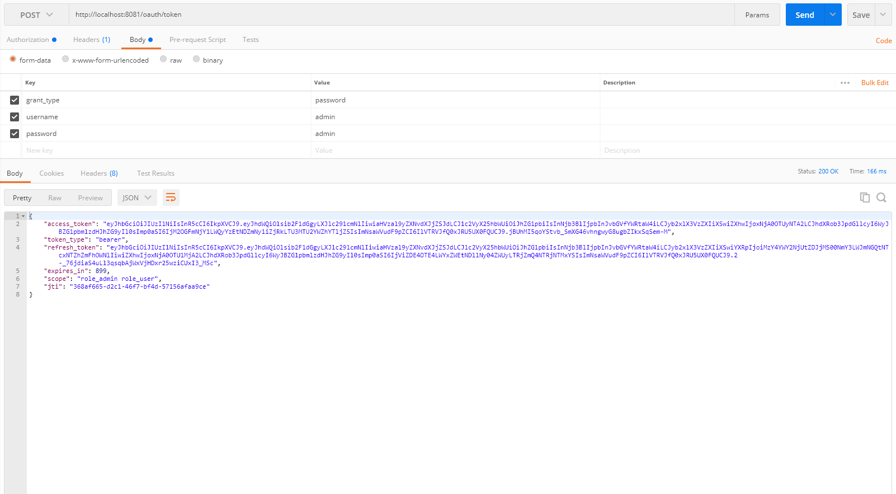
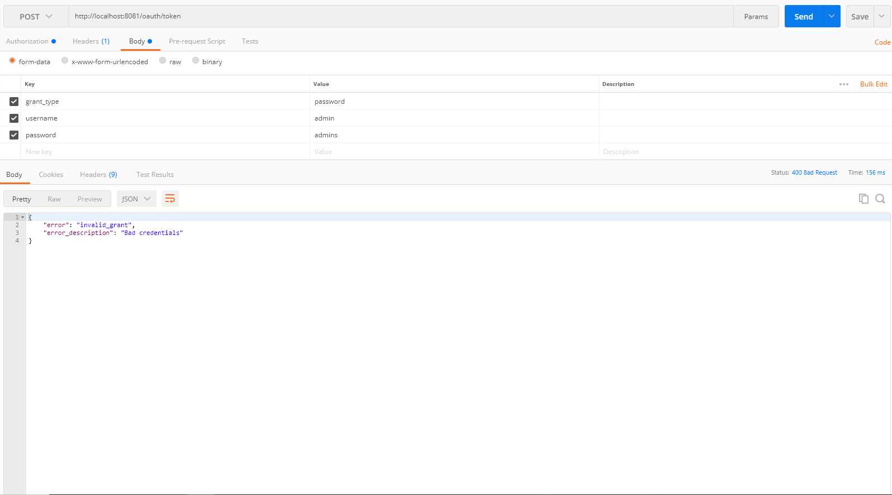
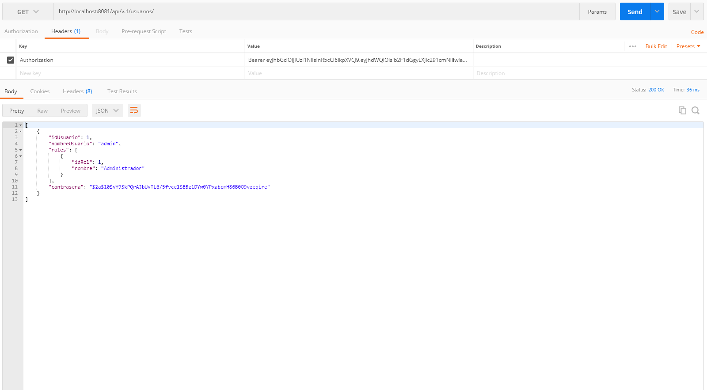
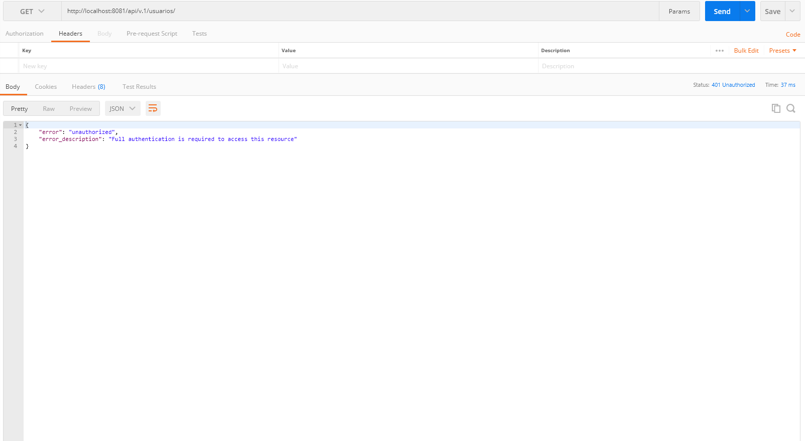

# Oauth2 con jwt

Autenticación usando oauth2 con jwt (JSON Web Token).

# Flujo de trabajo

Git Flow

## Construido con 🛠️

Este proyecto esta construido con las siguientes tecnologias:

* Java 1.8
* Spring MVC with Spring Boot
* PostgreSql
* Maven
* Flyway

 * La arquitectura web está construida con los siguientes componentes:
   * DTO: Objetos que se usan para la comunicación a través de las API
   * Controller: Responde a eventos lanzados por el usuario desde la web.
   * Service: Implementa la logica de procesamiento de información y la logica de negocio.
   * Repository: Interfaces para la base de datos, guarda, elimina y consulta.
   * Entity: Entidades de la base de datos.
   

### Instalación 🔧

* Clone el proyecto usando el comando

```
https://github.com/ricardobet12/logistic
```

* Abra el proyecto en su editor proferido

* Construya el proyecto para que descargue todas las dependencias necesarias.

* Compile el proyecto. Automanticamente se crearan las tablas en la base de datos.

* Modelo de base de datos

	


## Capturas de pantalla

* Datos autenticacion basica



* Datos del usuario



* Generacion de token exitoso



* Credenciales incorrectas



* Consumir servicio con el access_token.



* Error de autorizacion para consumir un servicio sin el token.




## Autores ✒️

* **Ricardo Betancourth Bolivar** - [RicardoBet](https://github.com/ricardobet12)

## Licencia 📄

Este proyecto está bajo la Licencia (MIT) - mira el archivo [LICENSE.md](https://github.com/ricardobet12/multi-tenant-spring-boot/blob/main/LICENSE) para detalles
